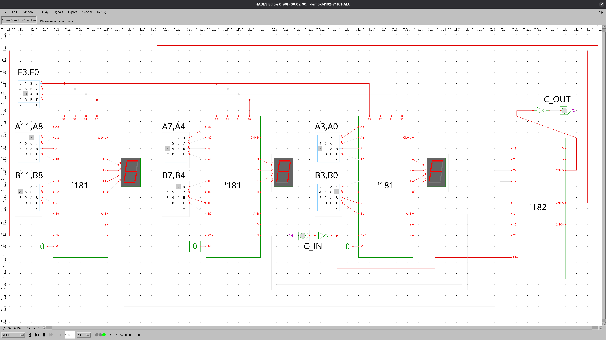

# 74181/74182 Carry Lookahead ALU — Restored Hades Java Simulator (2025 Edition)

Originally developed at the University of Hamburg for digital logic education (circa 2000–2006),
this interactive ALU simulator was rescued from the Internet Wayback Machine and made runnable on
modern Linux systems. It demonstrates the classic 4-bit 74181 ALU with a 74182 carry-lookahead
unit using the Hades logic simulator.

## Features
* Complete TTL-style schematic simulation of the 74181 and 74182 pair  
* Working GUI with switch/LED interaction on modern Linux (Fedora, GNOME, Wayland)  
* Scaled UI for HiDPI displays via `-Dsun.java2d.uiScale=2`  
* One-click launcher (`./alu74181`) and GNOME `.desktop` integration  


## Quick Start

```bash
git clone https://github.com/jrendon/alu74181.git
cd alu74181

Launch:
./alu74181
```

Optionally install Gnome Desktop Application link:
```bash
cp alu74181.desktop ~/.local/share/applications/
```

<p align="center">
  
</p>

## **Requirements**:
OpenJDK 8 or Later (works best with AWT mode)

## Background:
The 74181 was the first complete ALU on a single chip (1970), forming the arithmetic core of
many minicomputers. Its companion 74182 provided lookahead carry logic, reducing propagation
delay across multi-chip ALUs. This simulator visualizes those internal signals in real time.

## Credits:
TAMS Group, Universität Hamburg, for the original Hades simulator.

Restored and packaged for modern systems by Josh Rendon


